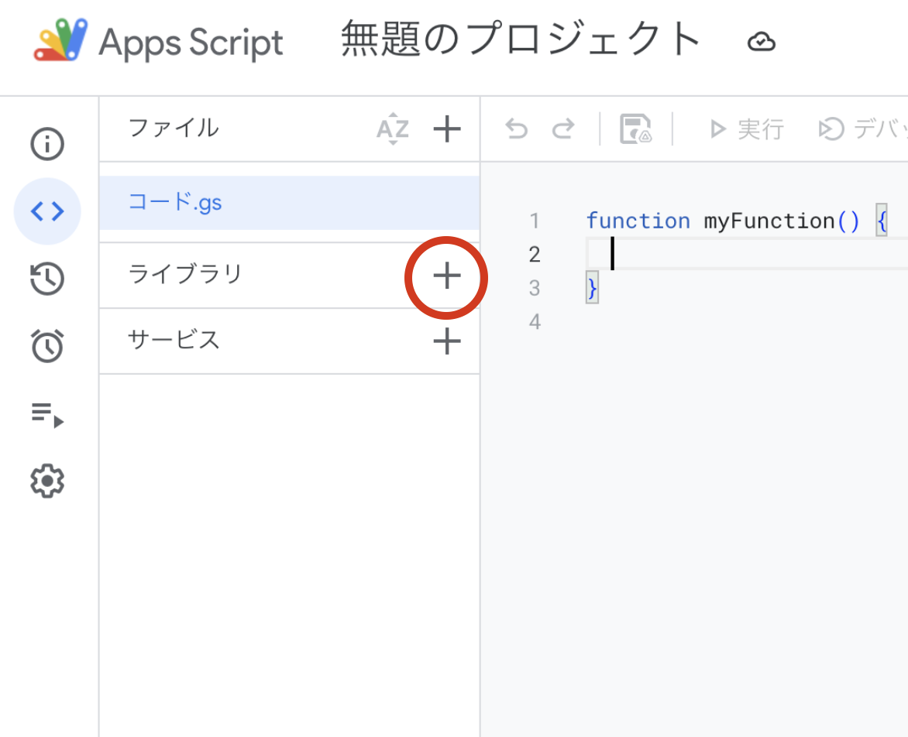
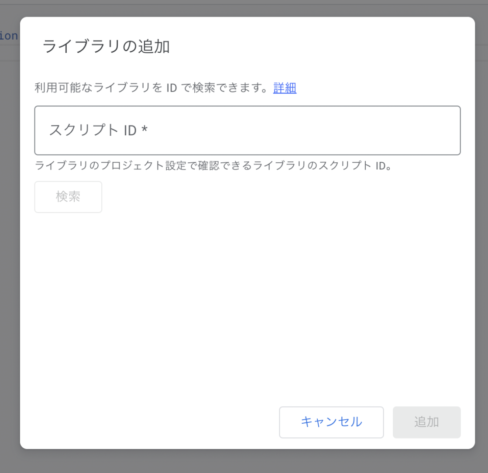
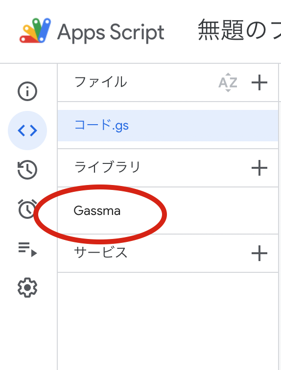

# 導入方法

GASsma の導入方法は 2 つあります。どちらも同じライブラリの同じ機能を使えます。

| 方法 | 向いている場面 |
| --- | --- |
| [CLI（ローカル開発）](#cliローカル開発) | 型安全に開発したい。エディタの補完やビルドを使いたい |
| [GAS スクリプトエディタ](#gas-スクリプトエディタ) | 小さなスクリプト。ローカル環境を用意せずに試したい |

## CLI（ローカル開発）

`npx gassma bootstrap` を使うと、clasp + esbuild + TypeScript + GASsma の環境をコマンド一発で作れます。事前のインストールは不要です。

```bash
npx gassma bootstrap my-app
```

手順は[クイックスタート](/docs/quickstart)にまとめています。

既存のプロジェクトに追加する場合は、パッケージをインストールしてから `gassma init` でスキーマと設定ファイルを作ります。

```bash
npm i gassma
npx gassma init
```

CLI のコマンド一覧は [CLI コマンド](/docs/reference/cli/commands)を参照してください。

## GAS スクリプトエディタ

まず、AppsScript を開いた後、ライブラリの「+」ボタンをクリックします。



すると下記画像のようなダイアログが表示されるので、「スクリプト ID」に下記を入力し、検索ボタンを押します。

```
1ZVuWMUYs4hVKDCcP3nVw74AY48VqLm50wRceKIQLFKL0wf4Hyou-FIBH
```



すると以下の画面が表示されるので、「追加」ボタンを押します。


ライブラリ欄に「Gassma」と表示されていたら成功です！



書き方は [GAS エディタでの利用](/docs/reference/gas-editor)を参照してください。

`npx gassma bootstrap` を使った場合、このライブラリ追加は自動で行われます（`dist/appsscript.json` に設定されます）。
