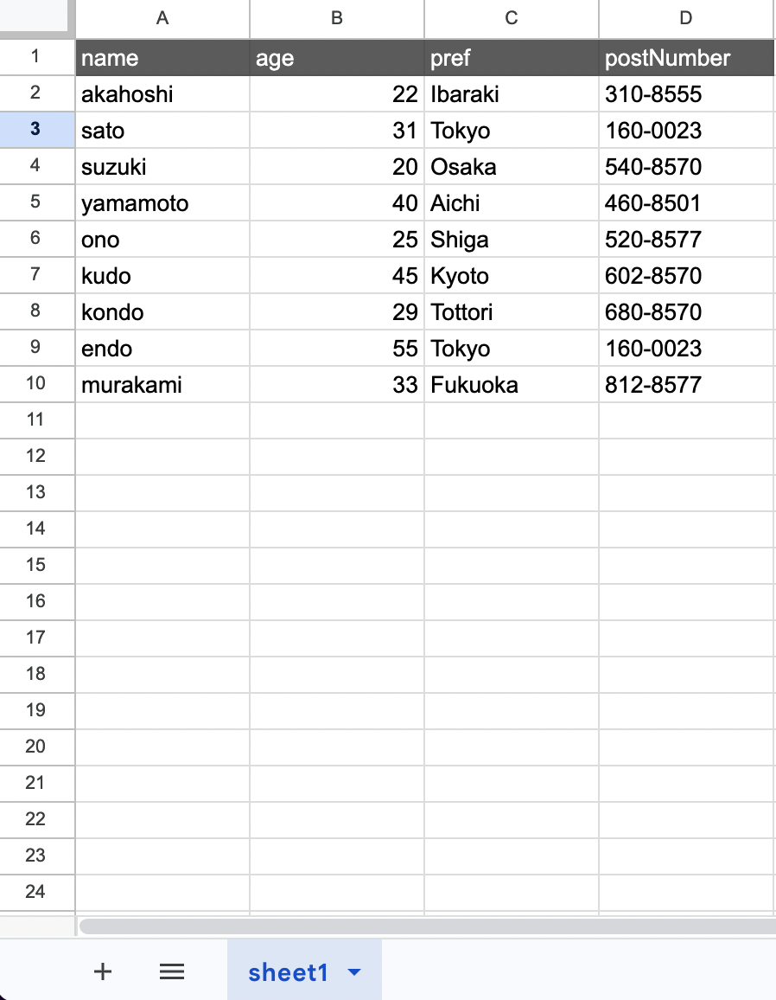

# deleteMany()

特定の条件に合致した全ての行を削除したい場合に利用します。

## 説明例用のシート



## 説明

上記例から以下の処理を行いたいとします。

- age => **20 の行を削除**

この場合以下のコードとなります。

```ts
// gassma.sheets.{{TARGET_SHEET_NAME}}.deleteMany
const result = gassma.sheets.sheet1.deleteMany({
  where: {
    age: 20,
  },
});
```

戻り値は以下の形式です。

```ts
{
  count: 1;
}
```

削除された行の数が返されます。

また`where`の仕様は[findMany()の記事](../Read/findMany)の記事に準拠します。
