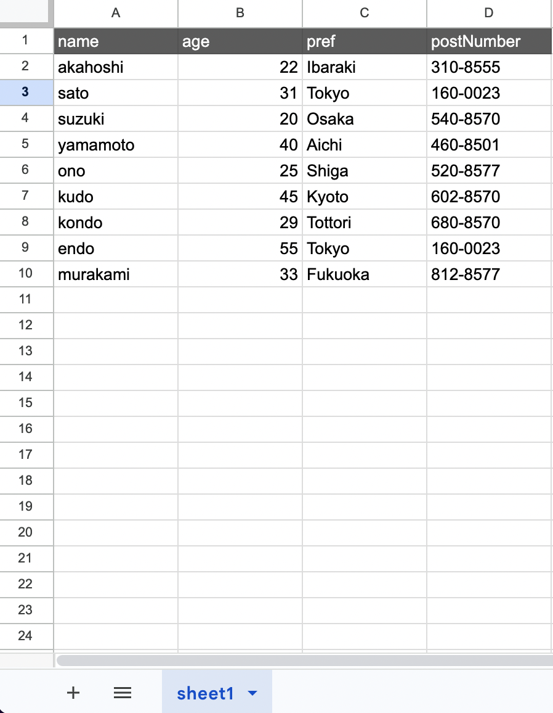

# findFirst()

特定の条件に合致した最初の行を取り出したい場合に利用します。

## 使用できるキー

| キー名   | 内容             | 省略 | 備考                                          |
| -------- | ---------------- | ---- | --------------------------------------------- |
| where    | 取得条件の指定   | 可   | 書かない場合は全ての行を取得します            |
| select   | 取得列の表示設定 | 可   |
| orderBy  | ソート設定       | 可   | 指定する列が 1 つの場合、配列の省略が可能です |
| take     | 取得数の設定     | 可   |
| skip     | スキップ数の設定 | 可   |
| distinct | 重複削除の設定   | 可   | 指定する列が 1 つの場合、配列の省略が可能です |

## 説明例用のシート



## 説明

上記例から以下の条件の行を取り出したいとします。

- age => **20 以上**

この場合以下のコードとなります。

```ts
// gassma.sheets.{{TARGET_SHEET_NAME}}.findFirst
const result = gassma.sheets.sheet1.findFirst({
  where: {
    age: {
      gte: 20,
    },
  },
});
```

戻り値は以下の形式です。

```ts
{
  name: 'akahoshi',
  age: 22,
  pref: 'Ibaraki',
  postNumber: '310-8555'
}
```

また、key のオプション等それ以外の仕様については[findMany()](./findMany)に準拠します・。
