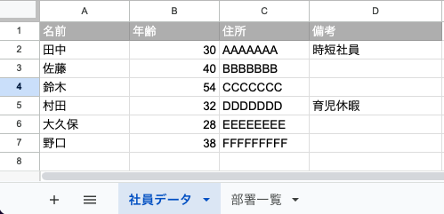
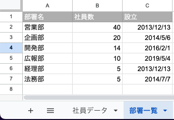
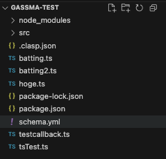

# 型ファイルの動的生成

GAS は clasp のような CLI ツールを利用すればローカルで TypeScript で開発することもできます。GASsma はローカルで TypeScript で GAS を開発したい開発者向けに型ファイルの自動生成機能を提供しています。

## 前提

自動生成機能を使う前に、以下のコマンドで GASsma の CLI ツールをインストールしてください。

```
$ npm i gassma
```

## 型ファイルの自動生成

例えば以下のテーブル構成でスプレッドシートが構成されているとしましょう。

- 社員データシート
  - 名前 => string
  - 年齢 => number
  - 住所 => string
  - 備考 => 空白セルあり string
- 部署一覧シート
  - 部署名 => string
  - 社員数 => number
  - 設立 => Date





この場合プロジェクトの**ルートディレクトリ**(package.json がある位置と同じ位置)に`schema.yml`というファイルを作成し、以下のように記載します。



```yaml
# シート名
社員データ:
  # 列名
  名前:
    # その列の型
    - string
  年齢:
    - number
  住所:
    - string
  備考?:
    - string

部署名:
  名前:
    - string
  社員数:
    - number
  設立:
    - Date
```

その後

```
$ npx gassma generate
```

と入力すれば GASsma の yaml ファイルに記載した内容に最適化された GASsma の型が生成されます。

## 生成された型ファイルの使い方

```ts
import { Gassma } from "gassma";

const gassma = new Gassma.GassmaClient();

function myFunction() {
  gassma.sheets.社員データ.create({
    data: {
      名前: "aa",
      年齢: 11,
      住所: "GGGGGGGGG",
    },
  });
}
```

等のように扱うことができます。

## 使用できる型

| 型名    | 内容   | 備考                                             |
| ------- | ------ | ------------------------------------------------ |
| number  | 数値   |                                                  |
| string  | 文字列 |                                                  |
| boolean | 真偽値 | true, false のようにどちらかに絞り込むことも可能 |
| Date    | 日付   | 具体的な日付を指定して絞り込むことは不可         |

## 細かい yaml ファイルの書き方

### 細かい型指定

また、部署名の名前の列の型を

- 営業部
- 企画部
- 開発部
- 広報部
- 経理部
- 法務部

に限定したい場合は以下のようにより細かく型を書くこともできます。

```yaml
# シート名
社員データ:
  # 列名
  名前:
    # その列の型
    - string
  年齢:
    - number
  住所:
    - string
  備考?:
    - string

部署名:
  名前:
    - 営業部
    - 企画部
    - 開発部
    - 広報部
    - 経理部
    - 法務部
  社員数:
    - number
  設立:
    - Date
```

### 別の型

string と number 等別の方を共存させることも可能です。
例えば部署名の設立の列に string を追加したい場合は以下のように書きます。

```yaml
# シート名
社員データ:
  # 列名
  名前:
    # その列の型
    - string
  年齢:
    - number
  住所:
    - string
  備考?:
    - string

部署名:
  名前:
    - string
  社員数:
    - number
  設立:
    - Date
    - string
```

### 「number」という名前の文字列を使いたい

「number」さん、「string」さん、「Date」さん「boolean」さんの 4 人が入社したとしましょう。
その場合は以下のように書きます。

```yaml
# シート名
社員データ:
  # 列名
  名前:
    # その列の型
    - "{{number}}"
    - "{{string}}"
    - "{{Date}}"
    - "{{boolean}}"
  年齢:
    - number
  住所:
    - string
  備考?:
    - string

部署名:
  名前:
    - string
  社員数:
    - number
  設立:
    - Date
    - string
```

二重の鉤括弧で括ってあげれば number 型ではなく`"number"`という文字列で出力されます。
