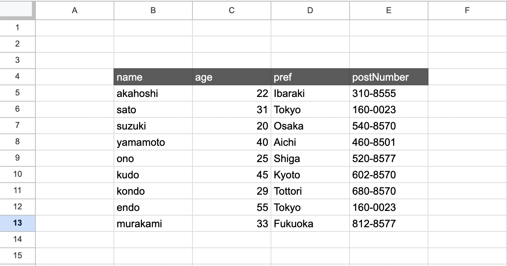
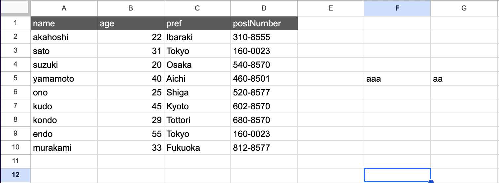

# changeSettings()

スプレッドシートの読み込み範囲を設定したい場合に利用します。

## 引数

| 引数名           | 説明                               | 型                 | 備考                                           |
| ---------------- | ---------------------------------- | ------------------ | ---------------------------------------------- |
| startRowNumber   | 列名が書いてある行番号を指定       | `number`           |
| startColumnValue | 最初の列名が書いてある列番号を指定 | `number \| string` | 列番号を指定するか列のアルファベットを指定する |
| endColumnValue   | 最後の列名が書いてある列番号を指定 | `number \| string` | 列番号を指定するか列のアルファベットを指定する |

## どう言ったときに利用するか

以下の状態にある場合は必ずスプレッドシートの操作を行う前に**必ず**`changeSettings()`を行ってください。

### 1. テーブルが左上にないとき



以上のテーブルの場合は以下のようなコードを書くことで正常にテーブルを読み込めます。

```ts
const gassma = new Gassma.GassmaClient();
// シートの操作をする前に必ず記述
gassma.sheets.sheet1.changeSettings(4, "B", "E");

const result = gassma.sheets.sheet1.findMany({});
```

### 2. 右側にメモ書き等別のデータがあるとき



```ts
const gassma = new Gassma.GassmaClient();
// シートの操作をする前に必ず記述
gassma.sheets.sheet1.changeSettings(1, "A", "D");

const result = gassma.sheets.sheet1.findMany({});
```
