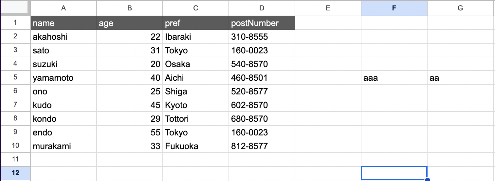

# changeSettings()

スプレッドシートの読み込み範囲を設定したい場合に利用します。

## 引数

| 引数名           | 説明                               | 型                 | 備考                                           |
| ---------------- | ---------------------------------- | ------------------ | ---------------------------------------------- |
| startRowNumber   | 列名が書いてある行番号を指定       | `number`           |
| startColumnValue | 最初の列名が書いてある列番号を指定 | `number \| string` | 列番号を指定するか列のアルファベットを指定する |
| endColumnValue   | 最後の列名が書いてある列番号を指定 | `number \| string` | 列番号を指定するか列のアルファベットを指定する |

## 列の指定方法

`startColumnValue` / `endColumnValue` には、**列番号（`number`）**または**列のアルファベット（`string`）**のどちらでも指定できます。

アルファベットは大文字・小文字を問わず、スプレッドシートの列見出しと同じ base-26 で解釈されます。`"A"`〜`"Z"` が 1〜26、`"AA"` から 2 文字に繰り上がります。

| 指定   | 列番号 |
| ------ | ------ |
| `"A"`  | 1      |
| `"Z"`  | 26     |
| `"AA"` | 27     |
| `"AZ"` | 52     |
| `"BA"` | 53     |

```ts
// 以下の 2 つは同じ意味になります
gassma.sheet1.changeSettings(1, "B", "E");
gassma.sheet1.changeSettings(1, 2, 5);
```

:::caution
アルファベット以外の文字（数字・記号・空文字など）を含む文字列を指定すると `GassmaInValidColumnValueError` がスローされます。数値で指定したい場合は文字列ではなく `number` を渡してください。
:::

## どう言ったときに利用するか

以下の状態にある場合は必ずスプレッドシートの操作を行う前に**必ず**`changeSettings()`を行ってください。

### 1. テーブルが左上にないとき


以上のテーブルの場合は以下のようなコードを書くことで正常にテーブルを読み込めます。

```ts
const gassma = new Gassma.GassmaClient();
// シートの操作をする前に必ず記述
gassma.sheet1.changeSettings(4, "B", "E");

const result = gassma.sheet1.findMany({});
```

### 2. 右側にメモ書き等別のデータがあるとき



```ts
const gassma = new Gassma.GassmaClient();
// シートの操作をする前に必ず記述
gassma.sheet1.changeSettings(1, "A", "D");

const result = gassma.sheet1.findMany({});
```
