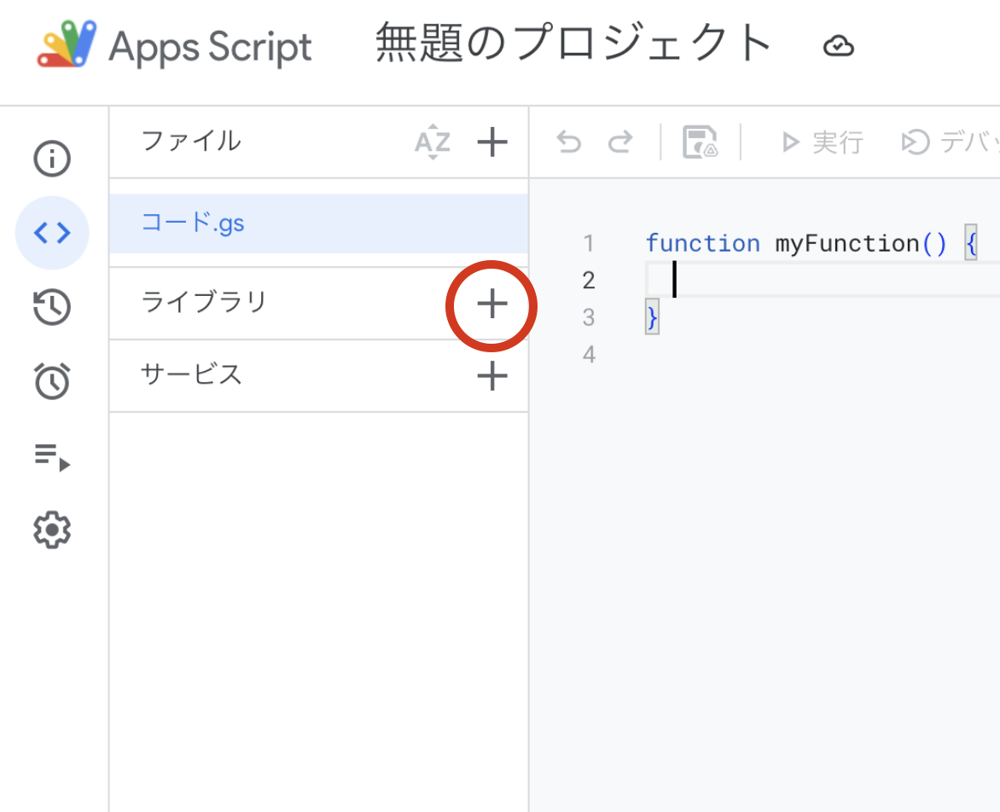
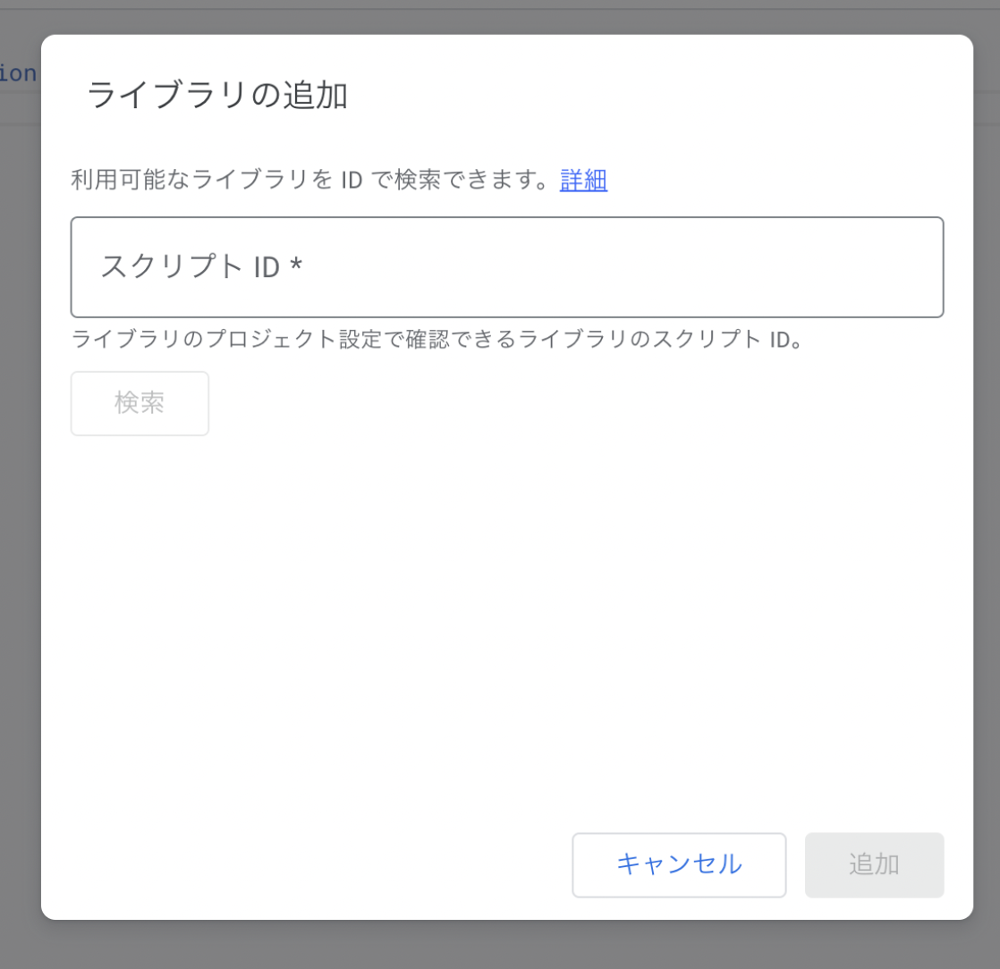
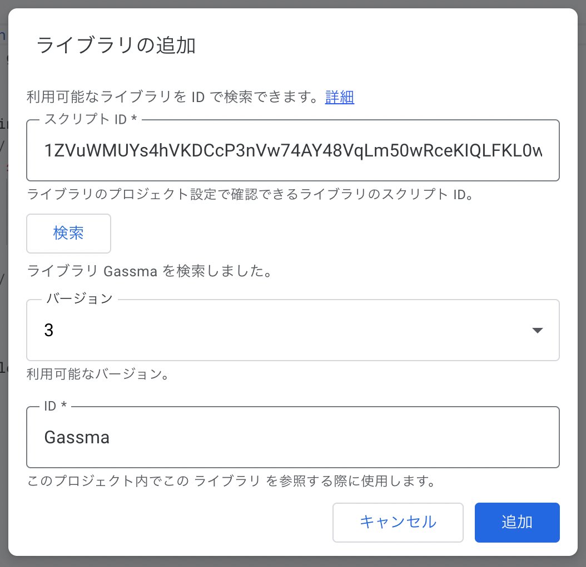
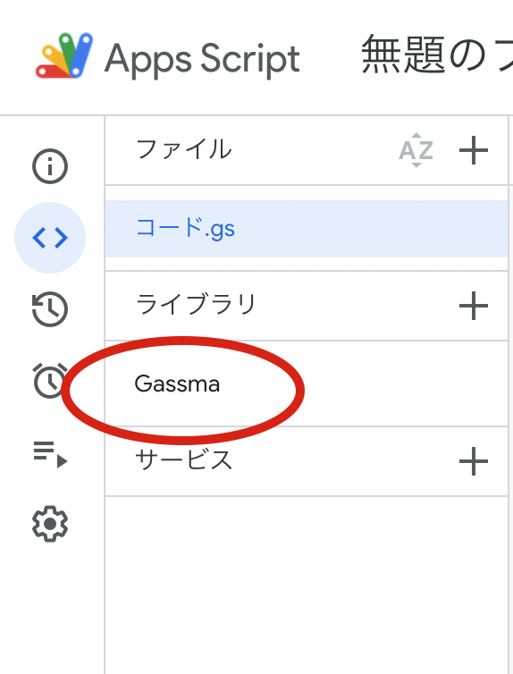

# 導入方法

まず、AppsScript を開いた後、ライブラリの「+」ボタンをクリックします。



すると下記画像のようなダイアログが表示されるので、「スクリプト ID」に下記を入力し、検索ボタンを押します。

```
1ZVuWMUYs4hVKDCcP3nVw74AY48VqLm50wRceKIQLFKL0wf4Hyou-FIBH
```



すると以下の画面が表示されるので、「追加」ボタンを押します。



ライブラリ欄に「Gassma」と表示されていたら成功です！



## 型ファイルのインストール

GoogleAppsScript をローカルで開発する場合、以下のコマンドで GASsma の型ファイルをインストールすることができます。

```bash
npm i gassma
```
