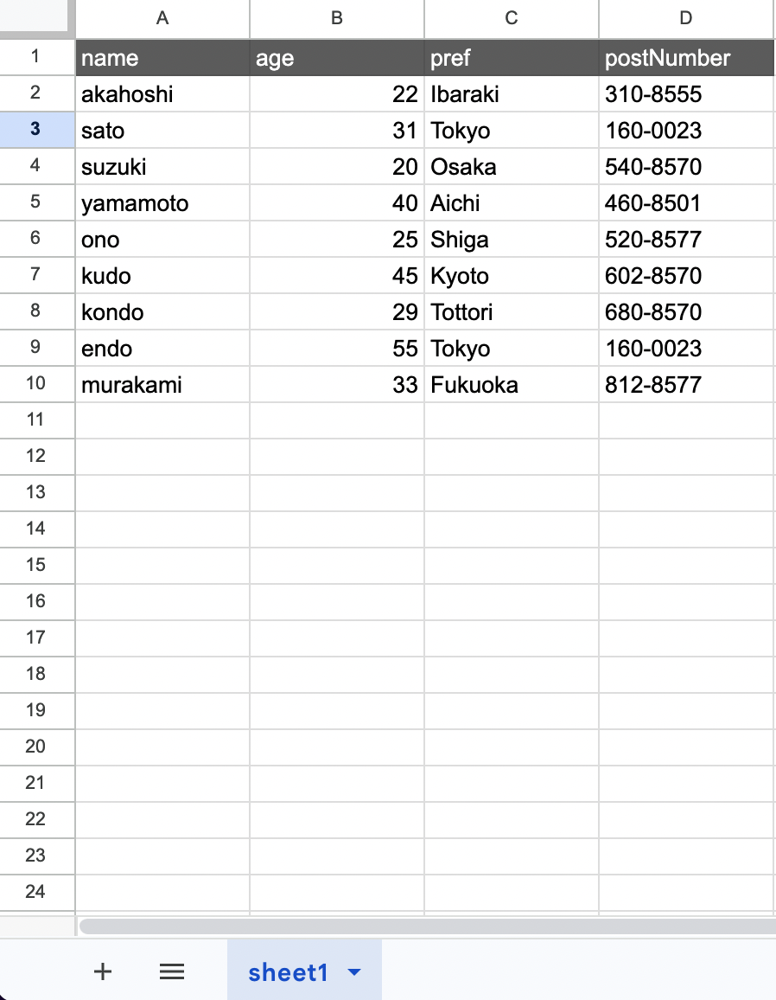

# create()

Used to add a new single row to the target sheet.

## Available Keys

| Key | Description | Optional | Notes |
| --- | --- | --- | --- |
| data | Specifies the data to register | Required | |
| select | Display settings for return value columns | Optional | Cannot be used with `omit` / `include` |
| omit | Exclusion settings for return value columns | Optional | Cannot be used with `select` |
| include | Retrieve related records | Optional | [Details here](/docs/reference/relation/include) |

:::note
`data` is required. Omitting it throws `GassmaMissingArgumentError` (message: Argument `data` is missing.).
:::

:::caution
`data` values must be scalar values a cell can hold (string, number, boolean, `null`, `Date`). Passing an object other than `Date` — `Map` / `Set` / `RegExp` / a class instance / a wrapper object such as `new String("x")` — throws a `GassmaInvalidValueError`.

```ts
gassma.sheet1.create({ data: { name: new Map() } });
// => Invalid value for argument `name`. Expected a scalar value, but received a Map.

gassma.sheet1.create({ data: { name: new Point(1, 2) } });
// => Invalid value for argument `name`. Expected a scalar value, but received an object.
```

`Gassma.raw` (see [raw](/docs/reference/raw)) and `fields` (see [fields](/docs/reference/fields)) can be passed as-is when writing. For the other affected values, see the [error list](/docs/reference/errors#values-a-cell-cannot-hold).
:::

## Example Sheet



## Description

Suppose you want to add the following row to the above example:

- name => **Shibata**
- age => **23**
- pref => **Shimane**
- postNumber => **690-8540**

The code would be:

```ts
const gassma = new GassmaClient();

// gassma.{{TARGET_SHEET_NAME}}.create
const result = gassma.sheet1.create({
  data: {
    name: "Shibata",
    age: 23,
    pref: "Shimane",
    postNumber: "690-8540",
  },
});
```

The return value has the following format:

```ts
{
  name: 'Shibata',
  age: 23,
  pref: 'Shimane',
  postNumber: '690-8540'
}
```

The data of the created row is returned.

Also, if you omit the age as follows, the `age` column of that row will be empty. Passing `undefined` as the value is treated the same as omission:

```ts
const gassma = new GassmaClient();

// gassma.{{TARGET_SHEET_NAME}}.create
gassma.sheet1.create({
  data: {
    name: "Shibata",
    pref: "Shimane",
    postNumber: "690-8540",
  },
});
```

The return value has the following format:

```ts
{
  name: 'Shibata',
  age: null,
  pref: 'Shimane',
  postNumber: '690-8540'
}
```

## Nested Write

When relation definitions exist, you can describe operations to simultaneously create and associate records in relation targets within `data`.

For details, see the [Nested Write reference](/docs/reference/relation/nested-write).
