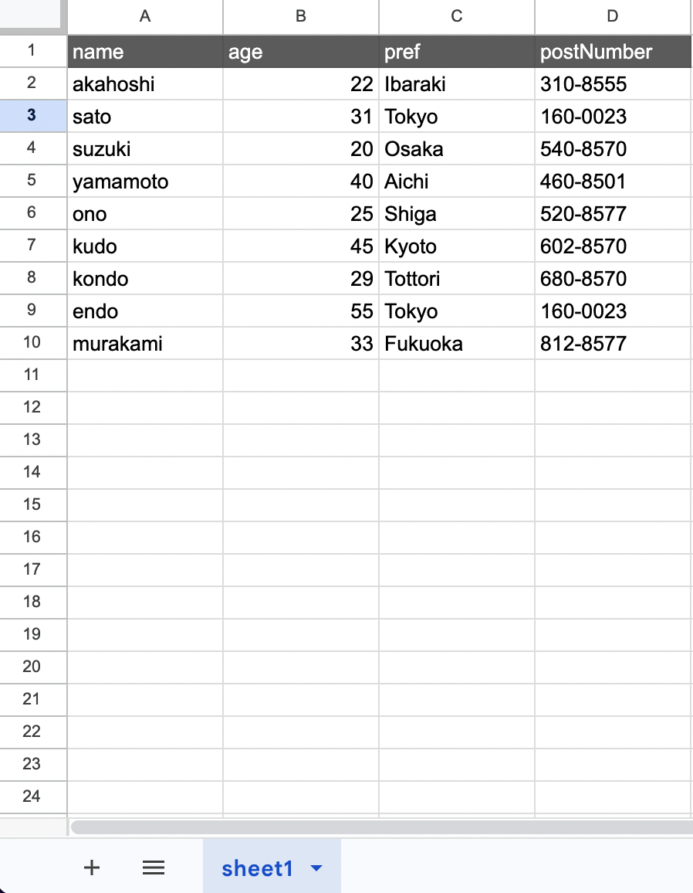

# updateMany()

Updates all rows matching the specified conditions to the given values.

## Available Keys

| Key | Description | Optional | Notes |
| --- | --- | --- | --- |
| where | Specifies update conditions | Optional | Targets all rows if omitted |
| data | Data to update | Required | |
| limit | Maximum number of records to update | Optional | Negative values cause an error |

## Example Sheet



## Description

Suppose you want to perform the following operation on the above example:

- age => **Change 20 to 21**

The code would be:

```ts
const gassma = new Gassma.GassmaClient();

// gassma.{{TARGET_SHEET_NAME}}.updateMany
const result = gassma.sheet1.updateMany({
  where: {
    age: 20,
  },
  data: {
    age: 21,
  },
});
```

The return value has the following format:

```ts
{
  count: 1;
}
```

The number of updated rows is returned.

The `where` specification follows [findMany()](../read/findMany).

## limit

You can specify the maximum number of records to update:

```ts
// Update at most 2 records
const result = gassma.sheet1.updateMany({
  where: {
    pref: "Tokyo",
  },
  data: {
    age: 99,
  },
  limit: 2,
});
```

Specifying `limit: 0` results in 0 updates (nothing is updated).

:::caution
Specifying a negative value for `limit` throws `GassmaLimitNegativeError`.
:::

## Atomic Number Operations

By specifying `increment` / `decrement` / `multiply` / `divide` in `data`, you can perform operations on the current value:

```ts
// Increment everyone's age by 1
const result = gassma.sheet1.updateMany({
  data: {
    age: { increment: 1 },
  },
});
```

| Operation | Behavior | Example |
| --- | --- | --- |
| increment | Addition | `{ increment: 5 }` → current value + 5 |
| decrement | Subtraction | `{ decrement: 3 }` → current value - 3 |
| multiply | Multiplication | `{ multiply: 2 }` → current value × 2 |
| divide | Division | `{ divide: 4 }` → current value ÷ 4 |

If the current value is not a number, `0` is used as the base for calculations. For details, see [update()](/docs/reference/crud/update/update).
