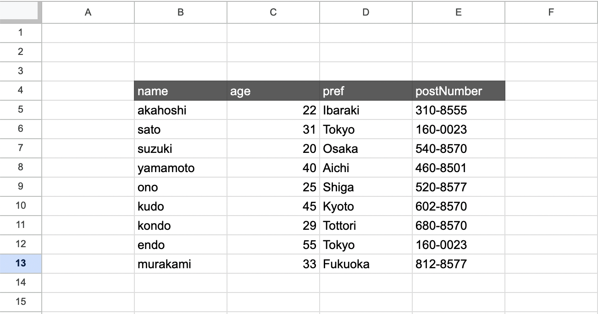

# changeSettings()

Use this when you want to configure the reading range of the spreadsheet.

## Arguments

| Argument Name    | Description                                         | Type               | Notes                                                    |
| ---------------- | --------------------------------------------------- | ------------------ | -------------------------------------------------------- |
| startRowNumber   | Specify the row number where column names are written | `number`           |
| startColumnValue | Specify the column where the first column name is    | `number \| string` | Specify either the column number or the column letter    |
| endColumnValue   | Specify the column where the last column name is     | `number \| string` | Specify either the column number or the column letter    |

## When to Use

If your spreadsheet is in any of the following states, you **must** call `changeSettings()` before performing any operations on the sheet.

### 1. When the Table Is Not in the Top-Left Corner



For a table like the one above, you can read the table correctly by writing the following code.

```ts
const gassma = new Gassma.GassmaClient();
// Must be called before any sheet operations
gassma.sheet1.changeSettings(4, "B", "E");

const result = gassma.sheet1.findMany({});
```

### 2. When There Is Other Data (e.g., Notes) to the Right


```ts
const gassma = new Gassma.GassmaClient();
// Must be called before any sheet operations
gassma.sheet1.changeSettings(1, "A", "D");

const result = gassma.sheet1.findMany({});
```
