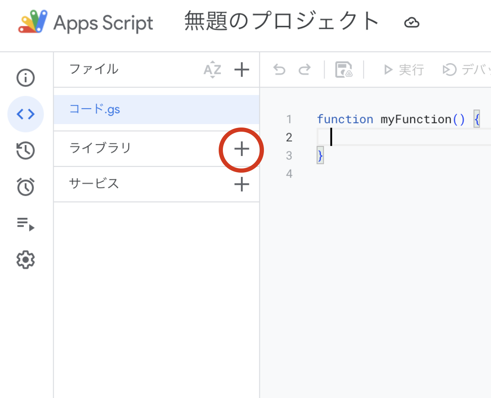
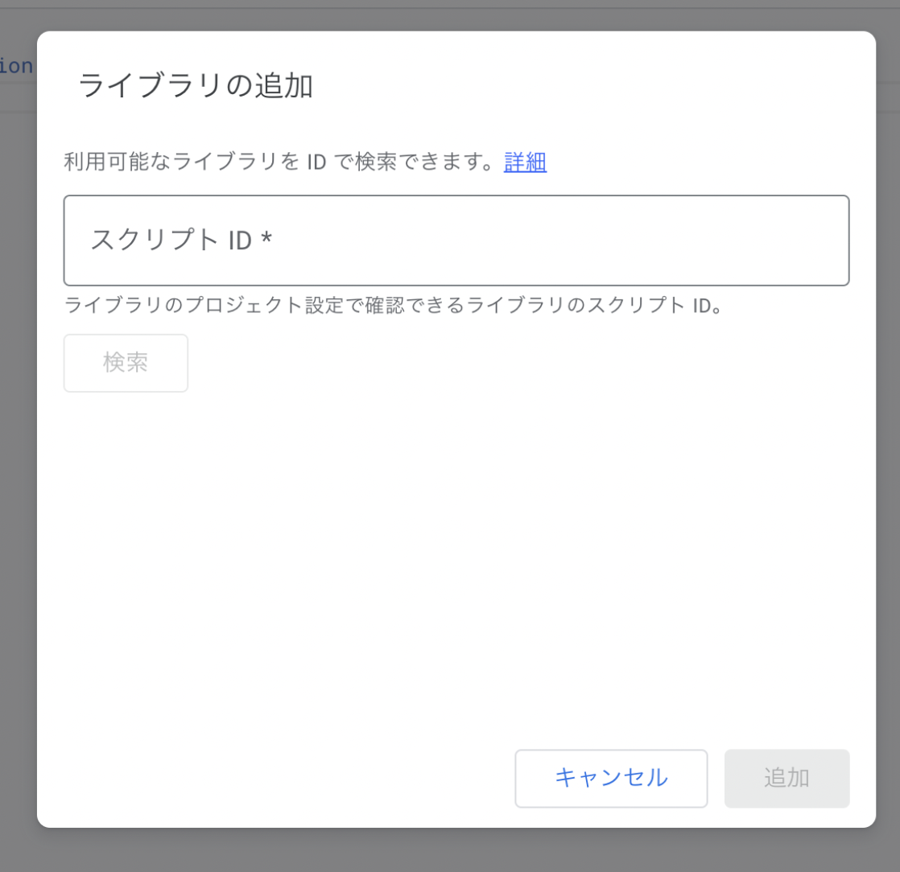
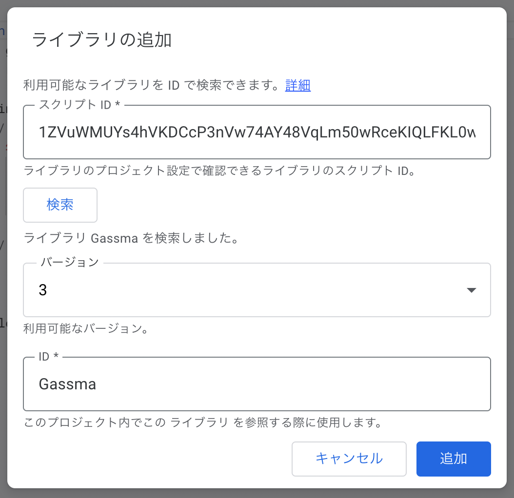
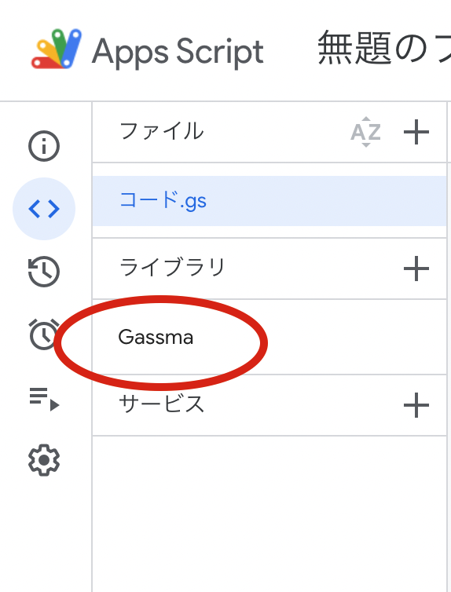

# Installation

First, after opening Apps Script, click the "+" button in the Libraries section.



A dialog like the one below will appear. Enter the following in the "Script ID" field and press the search button.

```
1ZVuWMUYs4hVKDCcP3nVw74AY48VqLm50wRceKIQLFKL0wf4Hyou-FIBH
```



The following screen will appear. Press the "Add" button.



If "Gassma" appears in the Libraries section, you're all set!



## CLI Tool Installation

When developing GoogleAppsScript locally using tools like clasp, you can install GASsma's TypeScript type file auto-generation tool with the following command.

For detailed usage, see [here](./reference/type-generation)

```bash
npm i gassma
```
