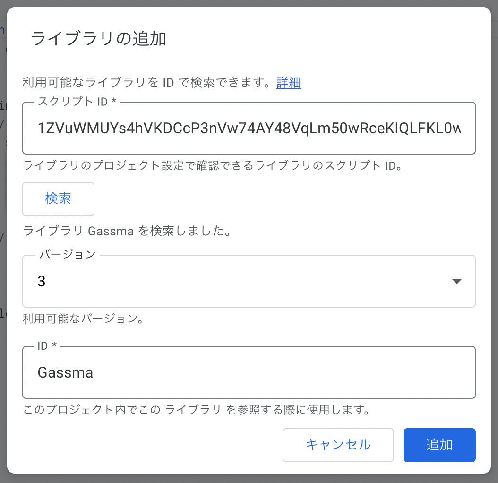

# Installation

There are two ways to install GASsma. Both give you the same library and the same features.

| Method | Best for |
| --- | --- |
| [CLI (local development)](#cli-local-development) | Type-safe development with editor completion and a build step |
| [GAS script editor](#gas-script-editor) | Small scripts, or trying things out without a local environment |

## CLI (local development)

`npx gassma bootstrap` sets up a clasp + esbuild + TypeScript + GASsma environment in one command. No prior installation is needed.

```bash
npx gassma bootstrap my-app
```

The steps are covered in the [Quickstart](/docs/quickstart).

To add GASsma to an existing project, install the package and then create the schema and config files with `gassma init`.

```bash
npm i gassma
npx gassma init
```

For the full list of commands, see [CLI Commands](/docs/reference/cli/commands).

## GAS script editor

First, after opening Apps Script, click the "+" button in the Libraries section.


A dialog like the one below will appear. Enter the following in the "Script ID" field and press the search button.

```
1ZVuWMUYs4hVKDCcP3nVw74AY48VqLm50wRceKIQLFKL0wf4Hyou-FIBH
```


The following screen will appear. Press the "Add" button.



If "Gassma" appears in the Libraries section, you're all set!


For how to write code, see [Using the GAS Editor](/docs/reference/gas-editor).

:::note
When you use `npx gassma bootstrap`, this library entry is added for you automatically (it is written into `dist/appsscript.json`).
:::
